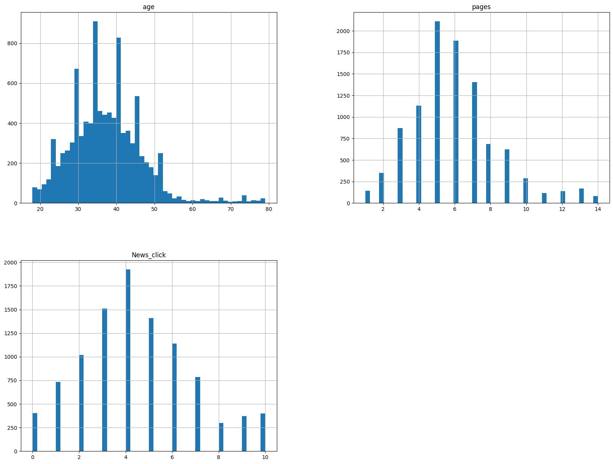
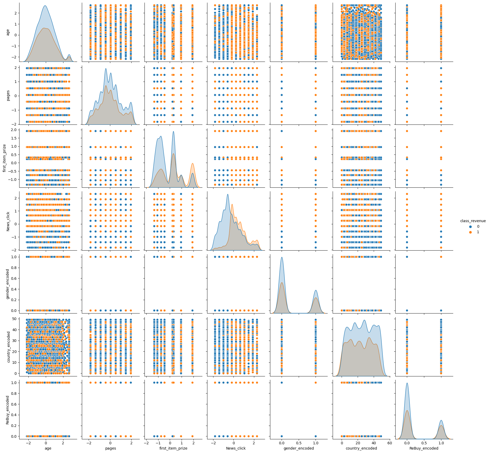
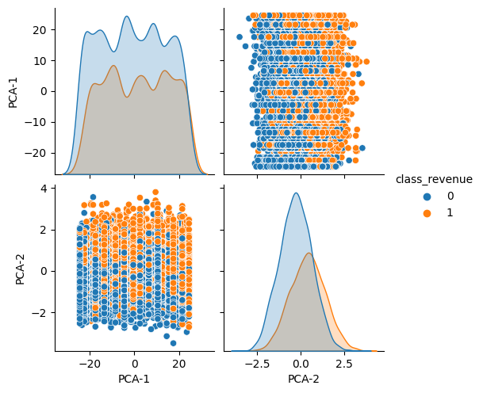
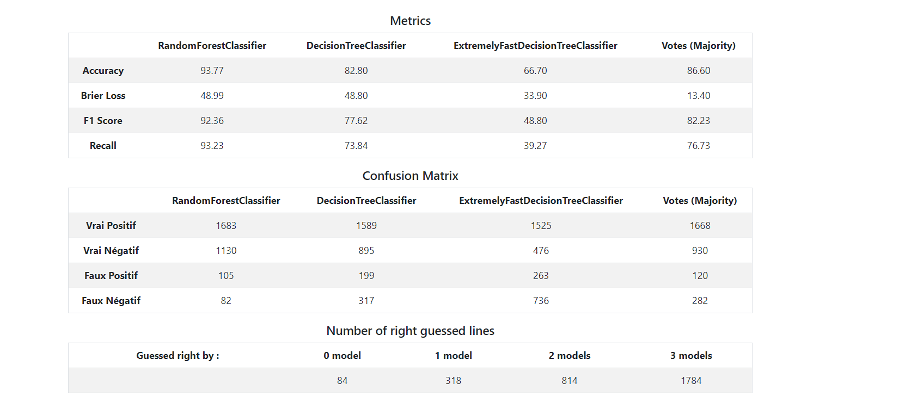

# Projet de groupe - 8INF436 - Forage des Données - UQAC – Hiver 2023

# Membres de l'équipe
- David LELIEVRE - LELD23050303
- Jules DELAMARE - DELJ25090208
- Amani SATOURI - SATA03620109
- Michael MORIN - MORM07039500

# Guide du projet
1. [Introduction](#réduction-sélection-de-dimensions)
2. [Préparation des données](#préparation-des-données)
3. [Réduction/ Sélection de dimensions](#réduction-sélection-de-dimensions)
4. [Modèles de Classification](#modèles-de-classification)
5. [Interface Utilisateur](#interface-utlisateur)

## Introduction
Pour notre projet, nous avons décidé d'utiliser un dataset provenant d'un site web d'achat en ligne. Après avoir préparé nos données, vous avons choisis de réduire les dimensions à 2. Quant au choix des modèles de classification, nous nous sommes arrêté sur 3 classifieurs différents. Nous avons choisis en premier RandomForest car il est rapide et efficace. Ensuite, nous avons choisis EFDT, également rapide et efficace, mais qui permet de faire de la classification en ligne. Enfin, nous avons choisis un arbre de décision classique car il est facile à comprendre et à interpréter. Finalement, notre interface utilisateur a été établie avec le framework Flask puisque l'équipe était familière avec ce dernier, il permet une association rapide avec le reste du projet en python et l'interface web est facilement accessible par tous.

*Recommendations *

Il est recommandé d'utiliser un environement virtuel et d'installer les modules nécessaire avant l'exécution ou le développement. De plus, pour le développement, le gitignore est préparé pour VS Code et Python. Voici un rappel des commandes pour ces recommendations:
```
python -m venv .env
.env/Scripts/activate.bat (Terminal)
ou
.env/Scripts./Activate.ps1 (Powershell)
pip install -r REQUIREMENTS.txt
```
Si un module est ajouté, veuillez utiliser `pip freeze > REQUIREMENTS.txt`.

## Preparation des données
Pour la préparation des données, nous avons tout d’abord remarqué que certaines variables étaient du mauvais type (par exemple les variables ‘first_item_prize’ et ‘revenue’ étaient de type ‘object’ alors qu’elles sont censées être de type numérique). Nous avons donc changé le type de ces variables-là. Nous avons ensuite réalisé des fonctions qui permettent de repérer les caractères spéciaux tels que ‘ ?’ qui ne sont pas forcément considérés automatiquement comme des valeurs manquantes. Pour les traiter, nous avons fais une fonction qui remplace tout d’abord ces caractères-là par ‘NaN’ afin de pouvoir visualiser le nombre de valeurs manquantes et les traiter plus tard. Pour le remplacement des valeurs manquantes pour les variables de type numérique nous avons utilisé la stratégie de remplacement par la médiane avec ‘SimpleImputer’. Nous avons remarqué grâce à des visualisation des variables la présence potentiel d’outliers et de bruit.

Pour pallier cela, nous avons remplacé les outliers pars les bornes inférieure et supérieure avec la méthode ‘clip’ de pandas. Les bornes inférieures ont été calculées à partir des quartiles Q1 et Q3 et de l’écart inter quartile (IQR). Les valeurs en dehors de l’IQR ont été remplacé par la borne inférieure ou supérieure selon le cas. On à ensuite standardiser les données et encodé le reste des données. Nous n’avons pas réalisé d’échantillonnage sur les données car les classes ne sont pas déséquilibré dans ce dataset.

## Réduction/ Sélection de dimensions
Nous avons choisi de faire une réduction de dimension en faisant une Analyse de Composante Principale. Nous avons obtenus à l’issu de l’ACP 2 composantes principales.
On a choisi de réaliser une réduction de dimension car cela nous permet de transformer un ensemble de données avec un grand nombre de variables en un ensemble de données avec un nombre réduit de variables. En effet, la réduction de dimension avec l’ACP permet de réduire les fonctionnalités globales comme avec un dataset volumineux qui va réduire le temps nécessaire au modèle pour réaliser des calculs. De plus, contrairement à la selection de dimension, nous perdons beaucoups moins d'informations lors de ce processus.
Visualisation avant acp:

Visualisation après acp:



## Modèles de Classification

Nous avons donc fait 3 modeles différents :

### Random Forest

Un random forest, optimisé avec une gridSearchCV. Avec train/test comme stratégie de validation. <br>
Les métriques utilisées sont :
- Accuracy
- Brier Loss
- F1
- Recall

Grâce à la gridSearchCV, nous avons pu trouver les meilleurs paramètres pour notre modèle et obtenir des résultats plus précis, entre 0,9 et 1 sur toutes les métriques.

### Decision Tree

Un simple arbre de décision, optimisé avec une gridSearchCV. Avec train/test comme stratégie de validation. <br>
Les métriques utilisées sont :
- Accuracy
- Brier Loss
- F1
- Recall

### Extremely Fast Decision tree

Un extremely Fast Decision Treen avec k-fold comme stratégie de validation.
Les métriques utilisées sont :
- Accuracy
- Brier Loss
- F1
- Recall

## Interface Utilisateur
Avec Flask, nous avons pu lié facilement la classification à l'interface utilisateur web. Après le chargement des modèles, la route index permet de saisir des données dans une table ou de televerser un fichier pour une classification. Une fois l'un des formulaires soumis, Flask fait appel à la préparation de données et la rédaction de dimensions mentionnées précédemment sur les nouveaux données. Ensuite, la fonction predict est utilisée et placée dans un dataframe de pandas. Finalement,  la fonction to_html de pandas reouten3 la table affichée. 
Une deuxième route, metrics, est disponible pour visionner les métriques de chaque modèle. Encore une fois, les fonctions de pandas ont été utilisées pour obtenir les résultats et le code html pour l'affichage. 

## Analyse des résultats

Les résultats de vos modèles de classification sont présentés sur la page metrics de l'interface utilisateur.
Pour cette analyse je me suis basé sur les résultats affichés sur l'image ci-dessous car il est probable que les résultats diffèrent à chaque fois que l'on lance l'application: 



Les quatre mesures d'évaluation utilisées pour comparer les performances des modèles sont :

L'exactitude (Accuracy) : qui mesure la proportion d'observations correctement classées par rapport à l'ensemble des observations.
La perte de Brier (Brier Loss) : qui mesure la moyenne de l'erreur quadratique entre les prédictions et les observations réelles.
Le score F1 (F1 Score) : qui mesure l'harmonique entre la précision et le rappel.
Le rappel (Recall) : qui mesure la proportion d'observations réellement positives qui ont été correctement identifiées par le modèle.

Sur la base de ces mesures, il semble que le modèle Random Forest soit le meilleur modèle avec une exactitude de 93,77 %, une perte de Brier de 48,99, un score F1 de 92,36 % et un rappel de 93,23 %. Il est suivi par le modèle Decision Tree qui a une exactitude de 82,80 %, une perte de Brier de 48,80, un score F1 de 77,62 % et un rappel de 73,84 % soit des résultats inférieurs en termes d'exactitude, de perte de Brier, de score F1 et de rappel. Cela peut être dû au fait que les arbres de décision simples ont tendance à surajuster les données et à ne pas généraliser correctement pour les données de test.

Le modèle Extremely Fast Decision Tree a obtenu le score le plus bas sur toutes les mesures d'évaluation avec une exactitude de 66,70 %, une perte de Brier de 33,90, un score F1 de 48,80 % et un rappel de 39,27 %. Il semble que la précision du modèle soit compromise en raison de l'utilisation de critères de division moins précis.

La colonne votes (majority) montre les métriques obtenus avec les résultats de la majorité des modèles (donc au moins 2 sur 3). La valeur prédite est donc 1 si au moins 2 des 3 modèles ont prédit 1 et 0 sinon. Les résultats devraient donc être meilleurs que ceux obtenus par les modèles individuels. Cependant, on constate que les résultats sont inférieurs à ceux obtenus par le modèle Random Forest seul et environ égaux à ceux obtenus par le modèle Decision Tree seul. Cela montre un réel écart de performance entre Random Forest et les autres modèles qui fait que pour certains cas, les résultats prédits par EFDT et DT vont être faux alors que ceux prédits par Random Forest sera vrai.

En termes de matrice de confusion, le modèle Random Forest a le plus grand nombre de vrais positifs, de vrais négatifs et de faux négatifs, ce qui signifie qu'il est capable de prédire correctement les deux classes (positives et négatives) et qu'il a un taux de faux négatifs plus faible.

En conclusion, sur la base de toutes les mesures d'évaluation, le modèle Random Forest est le meilleur modèle pour ce jeu de données.
